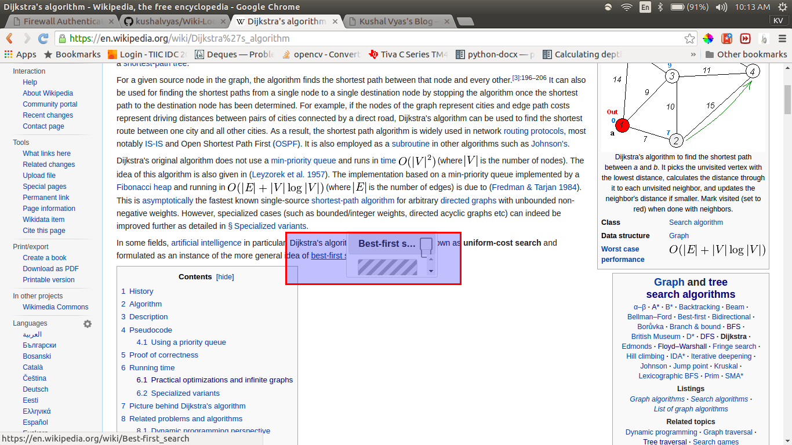
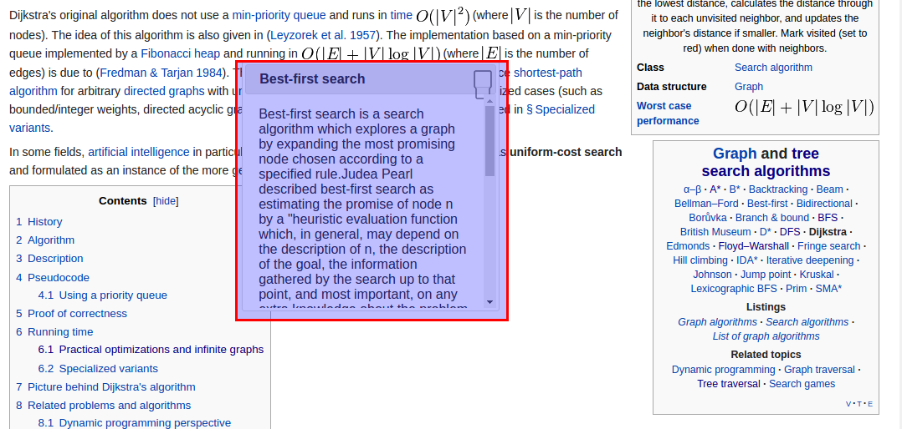

# Wiki-Look-Up

A Chrome Extension for simplifying Wikipedia Surfing

Wiki Lookup features the use of dynamically generated popups to simplify your Wikipedia Surfing Experience.

Just hover over the hyperlink, and wait for a small dialog to appear.

No Need to open up new tabs and feel lost while surfing wikipedia.org. Its' light-weight and compact. 

Everytime you hover over a wiki link, it'll show an appropriate amount of text to define the term.

### Install the Extension : 
- Clone the repository
- Please use google chrome with developer mode enabled
- Goto chrome://extensions 
- Download the .crx extensions file. And simply drag and drop it to the extensions page. 
- OR Load unpacked Extension ( provide path to repository/wiki_look_up/)

Enjoy surfing wiki :P 

